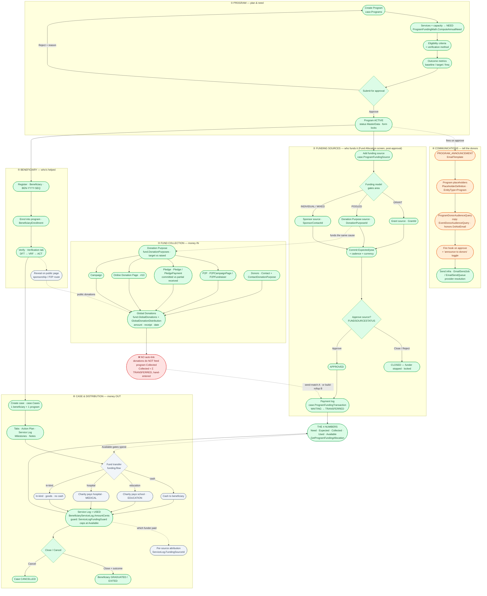

# Case Management — Money Flow (Detailed Flowchart)

> Renders in VS Code (Mermaid preview) / GitHub. Box = node · diamond = decision · subgraph = area.
> Each node names the screen + the entity/table behind it.
> Colors:  green = built ✅ · orange = missing-build 🔧 · red = gap/no-link ❌ · gray = planned ⏳

