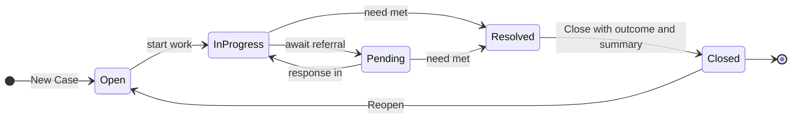
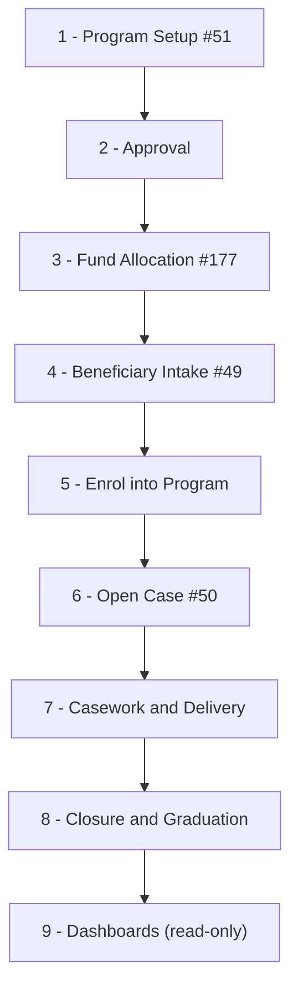
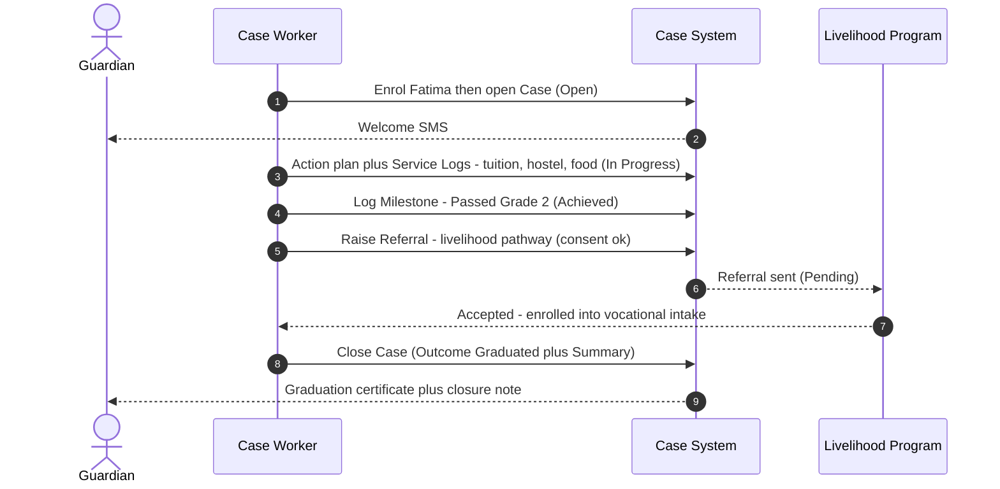
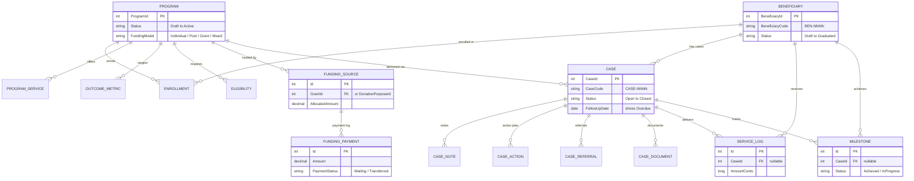

# Case Management — Knowledge Transfer

The full journey from setting up a **Program**, funding it, enrolling a **Beneficiary**, to opening, working and closing their **Case** — explained with one running example so the team can follow the module end-to-end.

| | |
|---|---|
| **Module** | CRM · Case Management |
| **Screens** | #49 Beneficiary · #50 Case · #51 Program · #177 Fund Allocation |
| **Chain** | Program → Beneficiary → Case |
| **Schema** | `case` |

> **What is it?** Case Management is where social workers **intake a beneficiary's need** (a child needing schooling, a medical issue, housing aid…), **track the work and the help delivered**, and finally **close it with an outcome**. But a case never stands alone — it always sits at the end of a chain: a **Program** defines *what* is offered and *how it is funded* → a **Beneficiary** is **enrolled** into it → a **Case** is opened to actually **deliver and track** that help.

> **Four screens, one story.**
> - **Program (#51)** defines the offering — services, eligibility, outcome targets and the *funding model*.
> - **Fund Allocation (#177)** records the actual money — which grants / donation purposes pay, and every payment as it arrives.
> - **Beneficiary (#49)** is the person and their enrolment.
> - **Case (#50)** is the workspace where the help is planned, delivered and recorded — its **Service Log** (tuition paid, food given) and **Milestones** (passed a grade) now live on the case itself, alongside the Action Plan, Notes, Referrals and Documents.

**Contents**
1. [The Flow — Program to Case](#1-the-flow--program-to-case)
2. [Full Data-Creation Map](#2-full-data-creation-map--start-to-end)
3. [Live Flow — One Program, Three Variants](#3-live-flow--one-program-three-variants)
4. [Entity Tables — Data Design](#4-entity-tables--data-design)

---

## 1. The Flow — Program to Case

First the full chain (how a case comes to exist), then the five-status lifecycle the case itself walks.

### From Program to Case — the full chain

This is what the team produces by walking the screens once, in order. Our running example is the **Hope Education Sponsorship** program (₹60,000/yr tuition + ₹30,000/yr hostel + ₹8,000/mo food) and a sponsored child, **Aisha Khan**.

1. **Create the Program** *(#51)* — name, category, capacity, then its **Eligibility Criteria**, **Services Included** (each typed: service type · provider type · funding flow · optional cost), **Outcome Metrics** (attendance, pass rate), **staff team + lead**, and the **Funding Model** (Individual / Pool / Grant / Mixed) with a note. Saved in status **Draft**. This is the menu of what the program offers.
2. **Approve the Program** — **Submit for Approval** (Draft → Pending Approval) then **Approve** (→ **Active**). Once active the program definition **locks** (read-only) so it can't be silently changed.
3. **Allocate & record Funding** *(#177)* — on the **Fund Allocation** screen (active programs only), **link the funding sources** (each a grant *or* a donation purpose, gated by the model), set each one's allocation + cadence, and keep its **Payment Log**: every incoming payment marked **Waiting** or **Transferred**. *Collected = Σ Transferred* — this is the cash ceiling that later caps service spend.
4. **Register the Beneficiary** *(#49)* — Aisha's intake: demographics, household, needs assessment, consent. Saved as **Draft**; **Register Beneficiary** commits her to **Active**. Code `BEN-NNNN`.
5. **Enrol into the Program** — creates a Program Enrollment (status **Enrolled**) and picks the services she'll receive. Her eligibility is checked against the program's criteria at this point. A Draft beneficiary can't get a case — being Active & enrolled is what brings her in.
6. **Open a Case** *(#50)* — to actually deliver and track the sponsorship. Links Aisha + the program + an owner; auto-codes `CASE-NNNN`, status **Open**.
7. **Build the Action Plan** — the planned steps: verify consent → pay tuition → arrange hostel → set up monthly food → collect report card → confirm next-grade promotion. Each item has an owner, a target date and a status.
8. **Deliver & record Services** — as each action is done, log the matching **Service Log** on the case: Tuition ₹60,000, Hostel ₹30,000, Food ₹8,000 × 12. **Spend is hard-capped at the program's available cash** (Collected − Used).
9. **Track Milestones** — outcomes achieved against the program's outcome metrics, logged on the case's **Milestones** tab: **Passed Grade 2** (Achieved), **Promoted to Grade 3** (In Progress).
10. **Keep Notes & Documents** — every visit / call / status-change is a **Note** (the activity feed); receipts, report cards and consent forms are **Documents** (the evidence).
11. **Refer out if needed** — for a need the program can't meet (e.g. a post-graduation job pathway), raise a **Referral** to an outside organisation.
12. **Close at the outcome** — when support concludes, **Close Case** with an outcome (e.g. *Graduated*) + closure summary; the case becomes read-only and the enrolment moves to **Graduated**. Set the beneficiary to **Graduated** — their record then locks too.
13. **Read back on Dashboards** — no new data: the **Program** and **Case** dashboards roll up everything created above (enrolment vs capacity, funding pool, services, milestones).

> **Where each Case tab gets its data.** **Notes & Activity** = visits, calls, status changes (the diary). **Action Plan** = the planned steps. **Service Log** = money & help delivered. **Milestones** = outcomes achieved. **Referrals** = hand-offs outside the program. **Documents** = uploaded evidence. **History** = an auto-assembled timeline (no table of its own).

### The five statuses

| Status | Meaning | Who moves it |
|---|---|---|
| **Open** | Just created. Sitting in the queue, work not started. | Auto-set when the case is created |
| **In Progress** | A case worker is actively working it — visiting, calling, delivering services. | Staff → "Update Status" |
| **Pending** | Waiting on someone *else* — usually an external referral response. | Staff → "Update Status" |
| **Resolved** | The need is met. Ready to wrap up. | Staff → "Update Status" |
| **Closed** | Final. Outcome + closure summary recorded. Read-only. | Staff → "Close Case" modal |

> ⚠️ **The 6th badge — `Overdue` — is NOT a real status.** It is **calculated on the fly**: any case that is still Open / In Progress / Pending **and** whose `Follow-up Date` is in the past shows up red. The stored status never changes — set a future follow-up date and the red clears.

### The journey in plain words

1. **Intake.** Staff clicks **+ New Case**, picks the beneficiary, writes a title + description, sets priority & assigned staff. On save the system auto-stamps a code (`CASE-NNNN`), sets status **Open**, and records today as the opened date.
2. **Casework.** Staff opens the case file and works it — adds **Notes** (home visits, phone calls), builds an **Action Plan**, logs **Service Log** + **Milestones**, and moves the status to **In Progress**.
3. **Referral (if needed).** If outside help is required, staff raises a **Referral** (auto-coded `REF-NNNN`) to an external organisation — **consent must be ticked** before it can be sent — and parks the case as **Pending** until they respond.
4. **Resolution.** Once the response is in and the need is met, status goes back to **In Progress** and then **Resolved**.
5. **Closure.** Staff clicks **Close Case**, picks an **Outcome** and writes a required **Closure Summary** (optionally a post-close follow-up + lessons learned). The case becomes **Closed** and read-only. A closed case can be **Reopened** back to Open if work must resume.

### State diagram

---

## 2. Full Data-Creation Map — Start to End

Read it **top to bottom**. Each stage is a screen; the items under it are the `case.*` tables that get rows at that step.

### What gets created at each stage

| # | Stage / screen | You create | Tables written | Status change |
|---|---|---|---|---|
| 1 | Program Setup (#51) | Program + criteria, typed services, outcome metrics, staff; funding model + note | `Programs`, `ProgramEligibilityCriteria`, `ProgramServices`, `ProgramOutcomeMetrics`, `ProgramStaffs` | Program = **Draft** |
| 2 | Approval | Submit → Approve | `Programs` (status) | Draft → Pending → **Active** (locks) |
| 3 | Fund Allocation (#177) | Link sources, set allocation + cadence, log payments | `ProgramFundingSources`, `ProgramFundingTransactions` | per payment: Waiting / Transferred |
| 4 | Beneficiary Intake (#49) | Beneficiary + household | `Beneficiaries`, `BeneficiaryHouseholdMembers` | Beneficiary: Draft → **Active** |
| 5 | Enrol into Program | Enrollment + selected services | `BeneficiaryProgramEnrollments`, `BeneficiaryEnrollmentServices` | Enrollment = **Enrolled** |
| 6 | Open Case (#50) | Case (links beneficiary + program + owner) | `Cases` | Case = **Open** |
| 7 | Casework & Delivery | Action items, notes, referrals, documents, **service logs (₹)**, milestones | `CaseActionItems`, `CaseNotes`, `CaseReferrals`, `CaseDocuments`, `BeneficiaryServiceLogs`, `BeneficiaryMilestones` | Case → **In Progress** |
| 8 | Closure | Close (outcome + summary), graduate beneficiary | `Cases`, `BeneficiaryProgramEnrollments`, `Beneficiaries` (statuses) | Case → **Closed**; Beneficiary → Graduated |
| 9 | Dashboards | Nothing — read-only roll-ups | — | — |

> **Two money rules to call out in the demo.** (1) Funding **Collected** = Σ **Transferred** payments only (Waiting is pledged, not cash). (2) A Service Log can never exceed the program's **available** cash (Collected − Used) — the form hard-blocks it. So the funding recorded in stage ③ is the budget the casework in stage ⑦ draws down.

> ⚠️ **Read-only locks.** Once a **Program** is Active / Paused / Completed, a **Case** is Closed, or a **Beneficiary** is Graduated / Exited / Deceased, its form renders read-only (amber lock banner, Save hidden). To edit a closed case you must **Reopen** it first.

---

## 3. Live Flow — One Program, Three Variants

Three children in the same **Hope Education Sponsorship** program, each at a different point in their journey. Together they cover every status from intake to graduation.

| Variant | Beneficiary | Case status | What's populated |
|---|---|---|---|
| **① Just started** | Rohan Das | **Open** | Recently enrolled. Action plan all Pending / In Progress, a couple of opening notes + a future follow-up, intake documents, one milestone In Progress. **No service delivered yet.** |
| **② In progress** | Aisha Khan | **In Progress** | Mid-delivery. Year-1 actions Done + recurring food, Year-2 actions pending. Service Logs (Tuition 60k, Hostel 30k, Food 8k×12). One milestone Achieved (Passed Grade 2), one In Progress. Full activity feed + evidence docs. |
| **③ Completed** | Fatima Ali | **Closed** | Finished. Beneficiary Graduated (+ exit date), enrollment Graduated, case Closed with outcome *Graduated*. All actions Done, 2 years of Service Logs, all milestones Achieved, final docs, one outgoing Referral. |

### Fatima Ali — a full sponsorship, intake to graduation

The **completed** journey touches all five statuses. The communication touchpoints are noted alongside each step.

| When | Status | What the case worker did | Communication |
|---|---|---|---|
| Jun 2024 | **Open** | Enrolled Fatima into the program, then created the case: title "Education sponsorship — Fatima Ali", category Educational Support, assigned to a case worker. System made the `CASE-NNNN` code. | 📩 Welcome SMS to guardian |
| Jun 2024 | **In Progress** | Built the **Action Plan**, paid Year-1 **tuition ₹60,000** + **hostel ₹30,000**, set up **monthly food ₹8,000** — each logged as a **Service Log** on the case. Status → In Progress. | 💰 Service-delivered notes logged |
| Apr 2025 | **In Progress** | End-of-year report card in → logged **Milestone: Passed Grade 2** (Achieved). Renewed Year-2 tuition + hostel. | 🏆 Milestone note + report card uploaded |
| Apr 2026 | **Pending** | Final report in — Fatima graduates. Raised a **Referral** to the Skills & Livelihood program for a post-graduation pathway. **Consent ticked** → Send enabled. | 📨 Referral hand-off to partner |
| May 2026 | **Resolved → Closed** | Marked Resolved, then **Close Case**: Outcome = *Graduated*, wrote the required **Closure Summary**. Enrollment → Graduated, beneficiary → Graduated (exit date set). Case locked read-only. | ✅ Graduation + closure to guardian |

> ↪️ **The "Overdue" twist.** Suppose mid-journey a worker set Aisha's (the in-progress case) follow-up date to a date that has already passed and went on leave. Her row instantly turns **red** with an **Overdue** badge — even though the saved status is still **In Progress**. The moment someone sets a future follow-up date, the red clears. Nothing about the stored status ever changed — Overdue is a live calculation, not a state.

### Communication sequence (who talks to whom)

---

## 4. Entity Tables — Data Design

All in the `case` database schema. The **case layer** = one parent (**Case**) + its children (Notes, Action Items, Referrals, Documents). The **delivery records** — **Service Logs** and **Milestones** — are beneficiary-owned but each carries an optional `CaseId`, so they surface as tabs on the case that delivered them. The "History" tab is built on the fly — it has no table.

### How the tables relate

### ① `case.Cases` — the parent

| Column | Type | Req | Notes |
|---|---|---|---|
| CaseId | int | PK | Primary key |
| CaseCode | string(30) | ✔ | Auto `CASE-NNNN`, unique per company |
| CaseTitle | string(200) | ✔ | Short title |
| Description | string(2000) | ✔ | Full background |
| BeneficiaryId | int | ✔ | FK → who is helped |
| ProgramId | int? | — | FK → delivery program |
| PriorityId | int | ✔ | Critical / High / Medium / Low |
| CategoryId | int? | — | Educational / Medical / Housing … |
| StatusId | int | ✔ | Open / InProgress / Pending / Resolved / Closed. **Overdue is NOT stored.** |
| AssignedStaffId | int | ✔ | FK → case owner |
| OpenedDate | date | ✔ | Defaults to today |
| FollowUpDate | date? | — | Past date + open status ⇒ **Overdue** |
| ClosedDate | date? | — | Set on close |
| CaseOutcomeId / ClosureSummary | int? / string? | — | Both required *at* close |
| ClosureFollowUpDate / LessonsLearned | date? / string? | — | Optional, from Close modal |

### Case children

**② `case.CaseNotes`** — the activity feed (every visit, call, or update)

| Column | Notes |
|---|---|
| CaseNoteId | PK |
| CaseId | FK → parent |
| NoteTypeId | Home Visit / Phone Call / Milestone … |
| Content ✔ | Note body |
| AuthorStaffId | Auto = current user |
| NotifySupervisor | Placeholder toast |

**③ `case.CaseActionItems`** — the action plan (tasks with owners & due dates)

| Column | Notes |
|---|---|
| CaseActionItemId | PK |
| CaseId | FK → parent |
| ActionSequence | Display order |
| ActionDescription ✔ | What to do |
| ResponsibleStaffId ✔ | Owner |
| TargetDate | Hidden when Recurring |
| ActionStatusId ✔ | Done / Pending / In Progress / Contingent |

**④ `case.CaseReferrals`** — hand-offs to external organisations

| Column | Notes |
|---|---|
| CaseReferralId | PK |
| CaseId | FK → parent |
| ReferralCode | Auto `REF-NNNN` |
| ReferTo ✔ | Org / provider |
| Reason ✔ | Why referred |
| ReferralStatusId | Pending → Accepted → Completed |
| ConsentGiven ✔ | **Must be true to send** |

**⑤ `case.CaseDocuments`** — file attachments (metadata only for now)

| Column | Notes |
|---|---|
| CaseDocumentId | PK |
| CaseId | FK → parent |
| FileName ✔ | e.g. report.pdf |
| FileSizeBytes / MimeType | From the picker |
| FilePathUrl | Placeholder — storage pending |
| UploadedByStaffId | Auto = current user |

### Delivery records — what the case actually produced

These two are beneficiary-owned (screen #49) but each row carries an optional `CaseId` linking it to the case that delivered it — that's why they appear as **Service Log** and **Milestones** tabs on the case.

**⑥ `case.BeneficiaryServiceLogs`** — a delivery record (every tuition payment, food parcel, etc.)

| Column | Notes |
|---|---|
| BeneficiaryServiceLogId | PK |
| BeneficiaryId | FK → who received it |
| CaseId / ProgramId / ProgramServiceId | Optional FKs → ties to case, program & the typed service |
| ServiceDate ✔ | When delivered |
| ServiceDescription ✔ | e.g. "Annual tuition (Year 1)" |
| AmountCents | Money in **paise** (₹60,000 = 6,000,000); capped at available pool |

**⑦ `case.BeneficiaryMilestones`** — an outcome achieved (passed a grade, got promoted)

| Column | Notes |
|---|---|
| BeneficiaryMilestoneId | PK |
| BeneficiaryId | FK → who achieved it |
| CaseId / ProgramOutcomeMetricId | Optional FKs → ties to case & the target metric |
| MilestoneTitle ✔ | e.g. "Passed Grade 2" |
| TargetValue / AchievedValue | e.g. "≥85%" / "88%" |
| StatusId ✔ | Achieved / In Progress / Not Achieved |

> **History tab = no table.** It is assembled at read-time from the case's own dates, its notes, status changes, and action-item updates — merged into one timeline. Nothing to store; it just reflects everything else.

### Program & funding tables

**Program (#51) children**

| Table | Holds |
|---|---|
| `ProgramEligibilityCriteria` | Who qualifies (+ document / verification config) |
| `ProgramServices` | Typed service catalogue — service type, provider type, funding flow, optional cost |
| `ProgramOutcomeMetrics` | Targets milestones are measured against |
| `ProgramStaffs` | Program team (+ lead) |

**Fund Allocation (#177) tables**

| Table | Holds |
|---|---|
| `ProgramFundingSources` | Each linked grant *or* donation purpose + allocated amount, cadence, period |
| `ProgramFundingTransactions` | The Payment Log — each payment **Waiting** or **Transferred** |

> Collected = Σ Transferred · Used = Σ Service Logs · Available = Collected − Used (the spend cap).

### Lookup values (reference)

| Lookup | Values |
|---|---|
| Case priority | Critical · High · Medium · Low |
| Case status | Open · In Progress · Pending · Resolved · Closed *(Overdue is calculated, not a status)* |
| Case category | Educational Support · Medical · Housing · Legal · Nutrition · Protection · Psychosocial · Livelihood · Referral · Other |
| Note type | Case Note · Home Visit · Phone Call · Service Delivered · Referral Update · Milestone · Status Change · Case Opened |
| Referral status | Pending · Awaiting Response · Accepted · Rejected · Completed |
| Case outcome | Resolved · Partially Resolved · Unresolved · Referred Out · Graduated · Beneficiary Exited |
| Program status | Draft · Pending Approval · Active · Paused · Completed · Rejected |
| Funding model | Individual · Pool · Grant · Mixed |
| Beneficiary status | Draft · Active · Waitlist · Graduated · Exited · Suspended · Deceased |
| Enrollment status | Enrolled · Waitlisted · Graduated · Exited · Suspended |
| Milestone status | Achieved · In Progress · Not Achieved |
