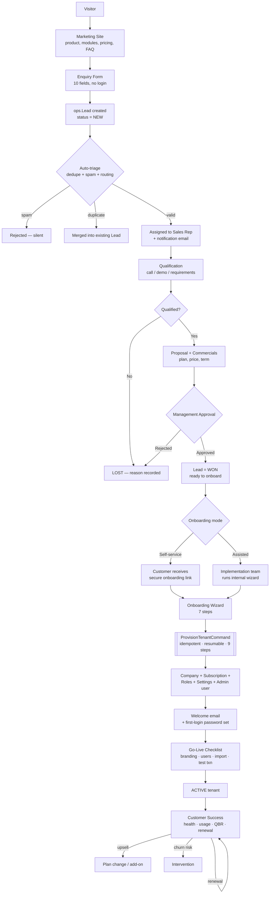
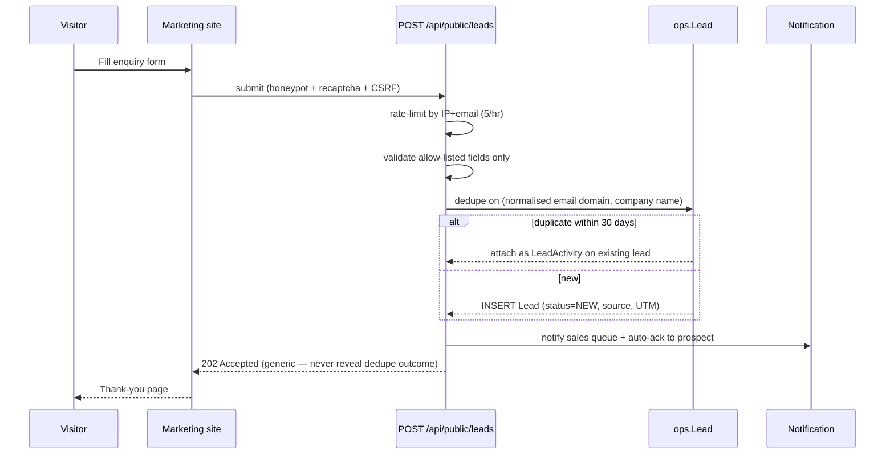
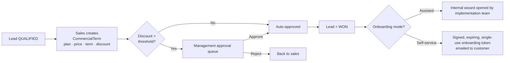
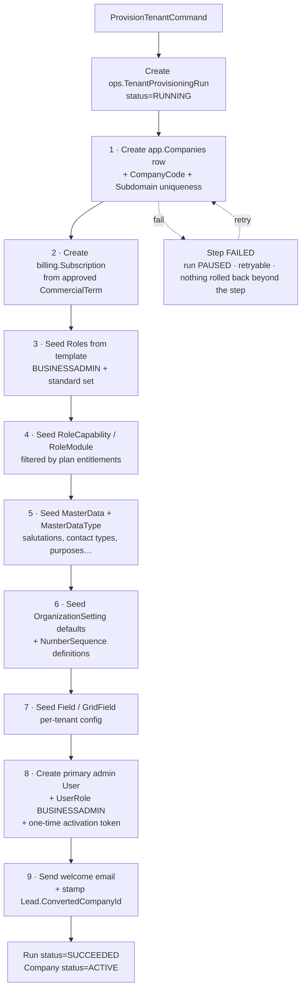

# PSS 2.0 — Go-To-Market, Lead Management, Company Onboarding & Product Administration

**Approach & Architecture Document**
Version 1.0 · 2026-07-24 · Status: **DESIGN — not yet built**

Companions:
- `PSS-2.0-PLANS-AND-ENTITLEMENTS-APPROACH.md` — the Plans / entitlement / quota layer (this doc consumes it)
- `PSS-2.0-MVP-SCOPE-AND-SETTINGS.md` — product scope and settings ownership
- `PSS-2.0-SETTINGS-SCREEN-RECONCILIATION.md` — settings partition (#75 / #85)

---

## §0 — TL;DR: the ten decisions

| # | Decision | Verdict |
|---|---|---|
| **D1** | Separate Product Admin Portal (Option 1) vs SuperAdmin area in existing app (Option 2)? | **Neither as stated — Option 2+ ("Control Plane module"): one codebase, one database, but a *separate deployed surface* (own host, own route group, own schemas, own JWT audience). Physically splittable later without a rewrite.** |
| **D2** | Do we build a full internal sales CRM for leads? | **No. Not in MVP.** Public enquiry form → `ops.Lead` table + a simple SUPERADMIN grid + status/assignment/notes. Meetings, sequences, forecasting, lead scoring → use an external tool (or dogfood PSS itself) until volume justifies. Building a CRM to sell a CRM is the classic trap. |
| **D3** | Where does the marketing site live, and what shape is it? | **Settled 2026-07-24 → six pages, built by us, inside the app's `(public)` route group.** P-01 Home · P-02 Modules · P-03 Pricing · P-05 FAQ · P-06 Enquiry · P-07 Thank-you (P-04 Customer stories post-MVP). Not a CMS, not Webflow, not a separate deploy. **The lead form is a shared component, embedded on Home and Pricing as well as owning P-06** — a visitor must never have to navigate to convert. One shared shell (header + anchor-aware nav + footer) across all six. Full anatomy in §4.2. |
| **D4** | Is a Lead ever a Tenant? | **No.** Lead and Company are separate entities with a one-way, one-time `Lead.ConvertedCompanyId` link. Never mutate a Lead row into a Company. |
| **D5** | Self-service vs assisted onboarding — two code paths? | **One path.** Both surfaces call the *same* `ProvisionTenantCommand`. The only difference is who fills the form and which steps are pre-filled. Two wizards, one engine. |
| **D6** | Biggest gap to close first? | **Tenant provisioning.** `CreateCompanyHandler` today is one `INSERT`. A usable tenant needs ~9 more steps (roles, capabilities, master data, settings, number sequences, admin user, subscription, welcome mail). This is MVP-1 item #1 regardless of everything else. |
| **D7** | Provisioning execution model? | **Idempotent, resumable, step-tracked** (`ops.TenantProvisioningRun` + `…RunStep`). Never a single 30-second transaction. Any step must be safe to re-run. |
| **D8** | Billing/payments in v1? | **No.** Contract + invoice offline (enterprise NGO sales are relationship-led, annual, invoice-paid). Record the commercial terms; integrate a payment gateway only when self-serve card checkout is a real demand. |
| **D9** | Public enquiry form security? | Treated as an **EXTERNAL_PAGE public POST**: rate-limit + honeypot + reCAPTCHA + CSRF + strict field allow-list + no enumeration in responses. Same hardening already used by donation/crowdfund public pages. |
| **D10** | Correction to the Plans doc | `IEntitlementService` signatures must use **`int companyId`**, not `Guid` — `Company.CompanyId` is `int`. Fix `PSS-2.0-PLANS-AND-ENTITLEMENTS-APPROACH.md` §6 before P1. |

---

## §1 — Grounding: what already exists (verified in code, 2026-07-24)

Design must start from what is real, not from a blank page. Verified facts:

### 1.1 Already built ✅

| Capability | Where | Note |
|---|---|---|
| `Company` tenant entity | `Base.Domain/Models/ApplicationModels/Company.cs`, table `app.Companies` | **PK is `int CompanyId`.** Has `CompanyCode` (unique), `CompanyName`, address block, org-profile fields (#75), and — critically — **`Subdomain`** and **`CustomDomain`**. |
| Hostname → tenant resolution | Screen #119 Login | Domain configuration is already half-built. |
| SuperAdmin identity | `ITenantContext.IsSuperAdmin()` | SuperAdmin = `GetCurrentTenantId()` returns null → bypasses tenant filters. |
| **Tenant impersonation** | `ITenantContext.GetActAsCompanyId()` via `X-Act-As-Company` header | Support "log in as customer" is already plumbed. Huge — this is normally the hardest control-plane feature. |
| Multi-company users | `GetAccessibleCompanyIds()`, `AccessibleCompanyRoles` JWT claim, `SwitchCompany` query | An internal implementation consultant can already hold access to many tenants. |
| Cross-tenant write guard | `TenantAccessBehavior` + `EffectiveCompanyId` + `TenantSaveChangesInterceptor` | Provisioning can safely write into a *newly created* tenant using `[TenantScope(CrossCompany)]`. |
| Global product catalog | `AuthModels/`: `Module`, `Menu`, `Capability`, `MenuCapability`, `RoleModule` — **no `CompanyId`** | Modules/menus/capabilities are product-level, shared by all tenants. |
| Per-tenant security | `Role`, `User`, `UserRole` (all have `CompanyId`) | |
| Per-tenant config | `sett.OrganizationSetting`, `UserSetting`, `Field`/`GridField`, `MasterData`/`MasterDataType`, NumberSequence | Everything a new tenant needs seeded. |
| `(master)` FE route group | `src/app/[lang]/(master)/` — contains only `masterdashboard` | **The product-admin shell already exists and is empty.** |
| `(public)` FE route group | `crowdfund`, `event`, `p2p`, `pray`, `volunteer`, `embed`, `templates` | Anonymous public pages are a solved, hardened pattern (`_EXTERNAL_PAGE.md`). |
| Screen #45 Company, #126 Modules, #174 Master Dashboard | REGISTRY | The seeds of a control plane already have screen numbers. |

### 1.2 Does **not** exist ❌

- **No** `Lead`, `Prospect`, `Enquiry`, `Opportunity`, `Onboarding`, `Ticket` entity. Zero. (`grep` for `Onboard|Lead|Prospect|Enquiry` hits only Grant-business "lead" false positives.)
- **No** `Plan`, `Subscription`, `Entitlement`, `Quota`, `UsageCounter` — see the Plans doc (greenfield).
- **No** tenant provisioning. `CreateCompanyHandler` is literally:
  ```csharp
  var company = command.company.Adapt<Company>();
  dbContext.Companies.Add(company);
  await dbContext.SaveChangesAsync(cancellationToken);
  ```
  No roles, no admin user, no settings, no master data, no subscription, no email. **A company created today is an unusable shell.** Everything is manual SQL.
- **No** marketing/landing surface, no pricing page, no lead form.
- **No** ticketing/support, no per-tenant health or usage telemetry.

> **The honest state:** PSS 2.0 has a strong *data plane* (the tenant app) and essentially **no control plane**. Onboarding is currently a developer running SQL scripts by hand. That works for client #1 and breaks at client #3.

---

## §2 — The mental model: Control Plane vs Data Plane

Every mature multi-tenant SaaS separates two planes. Keeping this vocabulary makes every later decision obvious.

| | **Control Plane** (the business of selling & running the product) | **Data Plane** (the product customers use) |
|---|---|---|
| Owns | Leads, Plans, Subscriptions, Tenant registry, Provisioning, Feature flags, Support tickets, Usage telemetry, Global catalog (Modules/Menus/Capabilities) | Contacts, Donations, Cases, Grants, Events, Volunteers, Campaigns |
| Users | Our staff (Sales, Implementation, Support, Finance) + anonymous prospects | Customer staff (BUSINESSADMIN and below) |
| Tenancy | **Cross-tenant by nature** | **Strictly tenant-isolated** |
| Blast radius of a bug | All customers | One customer |
| Change rate | Low | High |
| Schema | `ops.*`, `billing.*` (new) | `app.*`, `crm.*`, `finance.*`, `auth.*`, `sett.*` (existing) |

Two rules that follow directly and must never be violated:

1. **The data plane never reads or writes control-plane tables** — except through `IEntitlementService` (read-only, cached).
2. **The control plane never bypasses tenant isolation with raw SQL** — it goes through `[TenantScope(CrossCompany)]` so the audit trail and interceptors still fire.

Get this separation right *logically* today and the physical split (separate service, separate DB, separate region) is later a deployment task, not a rewrite. Get it wrong and control-plane logic metastasises through every tenant handler.

---

## §3 — Architecture decision: Option 1 vs Option 2

### 3.1 The options as posed

- **Option 1 — Separate Product Administration Portal.** Own repo/solution, own deployment, own auth, own DB (or shared DB), talking to the tenant app over APIs.
- **Option 2 — Extend the existing app with a Super Admin area.** Same app, same deploy, same auth, SuperAdmin sees extra menus.

### 3.2 Honest comparison

| Dimension | Option 1 — Separate Portal | Option 2 — SuperAdmin area in-app |
|---|---|---|
| **Security isolation** | ✅ Strongest. Control plane can be IP-allowlisted / VPN-only / separate identity provider. A tenant-app RCE cannot reach it. | ⚠️ Weakest as usually built — one XSS or authz bug in the tenant app can reach cross-tenant data. Mitigable, but only with discipline. |
| **Blast radius** | ✅ Portal outage ≠ customer outage. Deploy portal on Friday without fear. | ❌ Every control-plane deploy is a customer-facing deploy. |
| **Development cost (initial)** | ❌ High. Duplicate auth, layout, grid framework, GraphQL client, CI/CD, design system. Realistically 2–3× the screen cost. | ✅ Low. Reuses MASTER_GRID/CONFIG/FLOW patterns, existing auth, existing `(master)` shell. A screen is a screen. |
| **Access to global catalog** | ❌ Painful. `Module`/`Menu`/`Capability` live in the tenant DB. Portal either shares the DB (so not really separate) or needs a sync/API layer. | ✅ Native. It *is* the same DB. |
| **Provisioning a tenant** | ❌ Cross-service, distributed transaction, needs a job/queue and callback. | ✅ In-process MediatR command inside one DB. Trivial. |
| **Impersonation / "log in as customer"** | ❌ Needs a cross-service token-mint + trust relationship. | ✅ **Already built** (`X-Act-As-Company`). |
| **Maintenance** | ❌ Two codebases drift. Two upgrade cycles. Two sets of dependencies. | ✅ One. |
| **Team fit** | ❌ Needs a team that can carry two products. | ✅ Fits a small team. |
| **Scalability to 1000s of tenants** | ✅ Independent scaling | ⚠️ Control-plane queries (cross-tenant aggregates) compete with customer traffic on the same app instances |
| **Compliance story (SOC 2 / ISO)** | ✅ "Admin access is on a separate network boundary" is a clean control | ⚠️ Requires compensating controls (step-up MFA, admin audit, session limits) |

### 3.3 The trap in each option

- **Option 1's trap:** you build a beautiful portal, then discover 80% of what it does is CRUD over tables that live in the tenant DB. You end up with an API layer whose only job is to proxy your own database. You paid 3× and got a network hop.
- **Option 2's trap:** SuperAdmin becomes "the role that can do anything," control-plane logic leaks into tenant handlers (`if (IsSuperAdmin())` scattered everywhere), and the day you need a real security boundary you can't draw one.

### 3.4 ✅ Recommendation — **Option 2+ : the Control Plane Module**

**One codebase, one database, but a genuinely separate *surface*, built so the physical split is a deployment change and never a rewrite.**

Concretely:

| Layer | Rule |
|---|---|
| **Database** | New schemas **`ops`** (leads, onboarding, tickets, telemetry) and **`billing`** (plans, subscriptions, quotas). No control-plane table lives in `app`/`crm`/`finance`. No FK from a tenant table into `ops`. The only cross-schema FK allowed is `ops.*.CompanyId → app.Companies` and `billing.Subscription.CompanyId → app.Companies`. |
| **Backend** | Control-plane code lives in its own business folder (`Base.Application/Business/OpsBusiness/…`, `…/BillingBusiness/…`) and its own GraphQL endpoint group. Never mixed into tenant business folders. |
| **Authorization** | A dedicated **`PLATFORM_*` capability family** (`PLATFORM_LEAD_VIEW`, `PLATFORM_TENANT_PROVISION`, …) held only by internal roles. **`IsSuperAdmin()` alone is never sufficient** to reach the control plane — it must be capability-checked like everything else. |
| **Frontend** | Everything under the existing **`(master)` route group**, served on a **separate hostname** (`admin.<product>.com`) with its own layout and its own nav. Never a menu item inside a customer's sidebar. |
| **Network / auth** | `(master)` requires **step-up MFA** and is IP-allowlist-able at the gateway. JWT carries a distinct audience claim (`aud: platform`) that tenant endpoints reject and vice versa. |
| **Marketing site** | Same deploy, `(public)` route group, anonymous — no tenant context, no auth, no `ops` reads except the one hardened lead POST and the read-only public plans endpoint (§4.1). |

**Why this is the right call for PSS 2.0 specifically:**

1. **The `(master)` group and impersonation already exist.** Option 2+ is largely *finishing* an architecture that's already started; Option 1 would abandon it.
2. **The global catalog is in the tenant DB.** `Module`/`Menu`/`Capability` have no `CompanyId` — they're already product-level data sitting in the shared database. A separate portal must either share that DB (making it Option 2 with extra steps) or replicate it (making it Option 2 with extra bugs).
3. **Provisioning is the killer argument.** It must atomically create a Company, its roles, its capabilities, its master data, its settings, its admin user, and its subscription. In-process: one command. Cross-service: a saga, a queue, compensating transactions, and a support burden you cannot afford at this stage.
4. **Customer count.** With <10 tenants, Option 1's isolation benefit is theoretical while its cost is immediate. Sequencing matters more than idealism.

**When to revisit (write these triggers down now):**

| Trigger | Action |
|---|---|
| First enterprise security questionnaire demanding network-isolated admin access | Split the `(master)` FE to its own deploy (cheap — it's already a route group) |
| >200 tenants, or control-plane queries measurably degrading tenant latency | Split the control-plane API to its own service (schemas already separate) |
| DB-per-tenant / multi-region required | Control plane becomes the tenant registry + router. This is exactly what the `ops` schema is designed to become. |

Because the boundaries above are enforced from day one, each split is **weeks, not quarters**.

### 3.5 Domain & hosting model *(settled 2026-07-24)*

Three surfaces, one deploy. Two fixed hostnames, one dynamic family.

| Domain | Type | Serves | Route group | Auth |
|---|---|---|---|---|
| `www.<product>.com` | **Static** | Marketing pages + lead form + self-service onboarding token route | `(public)/(marketing)`, `(public)/onboarding/[token]` | None; token for onboarding |
| `admin.<product>.com` | **Static** | Internal staff — leads, commercials, provisioning, plans, tenant admin | `(master)` | Platform JWT (`aud: platform`) + `PLATFORM_*` capability + step-up MFA |
| `<tenant>.<product>.com` | **Dynamic, one per tenant** | Customer users | `(core)`, `(public)` | Tenant JWT (`aud: tenant`) |

**Subdomain only for MVP.** `Company.Subdomain` and `Company.CustomDomain` already exist on the entity; only the former is used in MVP-1.

| Done once, upfront — **Phase A prerequisite** | Done per tenant at provisioning |
|---|---|
| Wildcard DNS `*.<product>.com → load balancer` | **No infrastructure operation at all** |
| Wildcard TLS cert `*.<product>.com` (**DNS-01 challenge** — HTTP-01 cannot issue wildcards) | One `INSERT` of `Company.Subdomain`; hostname already resolves |

This is what makes a tenant usable the moment provisioning finishes — no DNS API call, no certificate issuance, no propagation wait in the critical path. **Nothing tenant-facing works until the wildcard pair exists**, so it is a Phase A blocker, not a later infra chore.

**Subdomain rules:** free-text (never a dropdown — customers want their own name), lowercase alphanumeric + hyphen, 3–63 chars, no leading/trailing hyphen; uniqueness enforced by index on `Company.Subdomain` (the availability check is UX, the index is correctness); reserved blocklist — `www`, `admin`, `api`, `app`, `mail`, `static`, `cdn`, `status`, `support`, `blog`, `login`, `auth`, plus profanity — **omitting this lets a tenant shadow the control plane**; suggest alternatives on collision; **immutable once `ACTIVE`**, and say so at the point of entry. Wildcard certs cover one level only, so tenants must never nest (`a.b.<product>.com`).

**Custom domains (`giving.acme.org`) are MVP-2**, as a tenant setting — not an onboarding step. They require a CNAME change by the customer's IT (hours to weeks, entirely outside your control) plus per-domain certificate issuance. Putting that in the wizard stalls provisioning on a third party. Tenants go live on their subdomain immediately and migrate later if they want.

---

## §4 — Deliverable 1: Overall business flow



### 4.1 Marketing surface — six pages, built by us, in the app

| Concern | Decision |
|---|---|
| Shape | **Six routes sharing one shell.** P-01 Home · P-02 Modules & Features · P-03 Pricing · P-05 FAQ · P-06 Enquiry · P-07 Thank-you. (P-04 Customer stories ships when there are real customers to quote.) Shared sticky header — logo · nav (Product · Modules · Pricing · FAQ) · **`Get a Demo`** primary · `Sign in` — and shared footer. |
| Where | **In the app**, `(public)` route group — `src/app/[lang]/(public)/(marketing)/…`, served on `www.<product>.com`. New screen type **`LANDING_PAGE`** (an `EXTERNAL_PAGE` variant: public surface + hardened POST, no admin-config surface). |
| Why in the app | It is a *product* site for a *product* we ship: it needs live plan data from `/api/public/plans`, it must share the design system, the i18n dictionaries and the `[lang]` segment, and it posts to our own API. A separate CMS deploy buys editorial independence we don't need yet and costs an extra pipeline, an extra domain, an extra CSP, and a design system that drifts within a quarter. |
| **Where the form lives** | **A shared `<EnquiryForm/>` component, not a page-only feature.** It owns P-06, and is *embedded inline* at the bottom of P-01 (Home) and P-03 (Pricing) — the two highest-intent pages. Every `Get a Demo` CTA on a page that already has the form scrolls to it; on other pages it routes to P-06. **A visitor must never have to navigate in order to convert.** |
| Content editing | **Typed content modules** — `content/{home,modules,pricing,faq}.content.ts` per locale. Marketing edits = one file, one PR, no schema, no CMS. Escalate to a CMS only when a non-developer must publish weekly. |
| Rendering | **SSG/ISR** for content, client-side only for the form. Non-negotiable for SEO and for OG cards on WhatsApp/LinkedIn (pattern already proven by `_EXTERNAL_PAGE.md` OG handling). |
| Pricing data | P-03 reads `GET /api/public/plans` at build/ISR time. Publish *tiers and inclusions*; hold *price* to "Talk to us" until packaging is locked (Plans doc §16). |
| Thank-you | **A real route (P-07)**, not an inline state — a distinct URL is what makes the conversion goal cleanly trackable in analytics and ad platforms. Redirect after a `202`; guard it so a direct visit shows generic content rather than a fake confirmation. |
| Integration surface | **Exactly two:** `POST /api/public/leads` (write) and `GET /api/public/plans` (read). Nothing else on the marketing pages touches the API. |

> **Why six and not one:** separate URLs give per-topic SEO targets, let sales deep-link (`/pricing`, `/modules#grants`) into a specific conversation, and keep each page short enough to actually finish reading. The cost — a shell, a nav, and one shared form component — is small because every section below is an isolated component either way.

---

### 4.2 Marketing pages — build specification

**Screen type `LANDING_PAGE` · route group `(public)/(marketing)` · anonymous · MVP-1**

#### 4.2.1 Page-by-page anatomy

**P-01 · Home / Product overview** — `/` · *the only page most visitors will read*

| # | Section | Purpose | Content |
|---|---|---|---|
| 1 | **Hero** | 5-second pitch | H1 outcome headline (*"Run your entire nonprofit on one platform"* — outcome, not feature list) · one-line subhead naming the buyer (NGOs, trusts, foundations) · dual CTA **Get a Demo** (primary → scrolls to §7) + **Explore modules** (→ P-02) · product screenshot or short looping UI clip, right on desktop / below on mobile |
| 2 | **Trust bar** | Instant credibility | Customer logos, or — until logos exist — a compliance strip (80G/12A receipts, FCRA-ready, full audit trail, data residency). **Never fabricate logos or counts.** |
| 3 | **Problem → outcome** | Frame the pain | 3 columns: *Donor data in spreadsheets* → *One donor record* · *Receipts done by hand* → *Auto-numbered 80G receipts* · *No visibility on grants* → *Live utilisation tracking* |
| 4 | **Module teaser** | Show breadth | 8–10 icon cards, one line each → "See all modules" → P-02 |
| 5 | **Benefits / why us** | Differentiate | 4–6 items: multi-branch & multi-currency · role-based access · full audit trail · WhatsApp/Email/SMS engagement · configurable fields & forms · India-compliance built in |
| 6 | **Pricing teaser** | Qualify early | Tier names + who each is for → "See full pricing" → P-03 |
| 7 | **Embedded enquiry form** | **Conversion point** | The shared `<EnquiryForm/>`, anchor `#demo`. Headline states the promise: *"Tell us about your organization — we'll reply within one business day."* |

**P-02 · Modules & Features** — `/modules`

Full module grid sourced from the same catalog as `auth.Modules` (Donations, Contacts & Donors, Receipts, Grants, Cases, Events, Volunteers, Campaigns, Reports, Settings) — icon, name, 2–3 lines, and per-module anchors (`#grants`) so sales can deep-link. Below it, 4–5 alternating image/text deep-dives for the highest-value flows: donation capture & receipting · donor 360 · grant lifecycle · dashboards. **Real screenshots from the running app, not stock art.** Ends with a CTA band → P-06.

**P-03 · Pricing / Plans** — `/pricing`

Tier cards from `GET /api/public/plans`: plan name, who it's for, records included, channels (Email → +WhatsApp → +SMS), module inclusions, per-card **"Talk to us"** CTA that scrolls to the embedded form with `plan_of_interest` pre-set. Below: a plan-comparison table, a short "how records are counted" explainer (pre-empts the most common objection), a 5-item pricing FAQ, then the **embedded `<EnquiryForm/>`**.

**P-04 · Customer stories** — `/customers` · **post-MVP.** Do not ship an empty or invented version; an obviously thin stories page costs more trust than no page at all.

**P-05 · FAQ** — `/faq`

6–10 accordion items grouped as Product / Implementation / Pricing / Security: implementation time · data migration · pricing model · data security & residency · on-premise · support & training. Emits `FAQPage` JSON-LD for rich results. Ends with *"Still have questions?"* → P-06.

**P-06 · Enquiry / Request a Demo** — `/enquiry`

The canonical home of the shared form (§4.2.2), plus a short reassurance rail: what happens next (30-min discovery call → tailored demo → proposal), response-time promise, direct email/phone for people who won't fill a form. Accepts `?plan=<code>` and UTM params.

**P-07 · Thank you** — `/thank-you`

Confirmation + expectation-setting (*"we'll reply to {email} within one business day"*), the three next steps, calendar link if one exists, links back into P-02/P-05 so the visitor keeps reading. Fires the conversion analytics event. Direct navigation without a submission token shows generic copy — never a fabricated confirmation.

> Sections most often shipped empty: trust bar, screenshots, prices. If there are no logos, no captures and no locked prices yet, ship the compliance strip, take real UI captures from the running app, and publish inclusions without numbers. Do not ship lorem or invented testimonials.

#### 4.2.2 The enquiry form — one shared component, three placements

`<EnquiryForm variant="page" | "embedded" />` — identical fields, validation and POST in both variants; `embedded` drops the page heading and reassurance rail. **Built once, mounted on P-01, P-03 and P-06.** Never fork it per page: three copies of a lead form become three different sets of fields within two months, and the analytics stop reconciling.

Exactly the 10 fields specified — **but only 5 are required**. Friction is the enemy; everything optional can be asked on the qualification call.

| # | Field | Type | Required | Notes |
|---|---|---|---|---|
| 1 | Organization Name | text | ✅ | `maxlen 200` |
| 2 | Contact Person | text | ✅ | `maxlen 150` |
| 3 | Business Email | email | ✅ | Format + MX-ish sanity check; free-provider domains allowed (many small NGOs use Gmail) but flagged `IsFreeEmailDomain` for triage |
| 4 | Phone Number | tel | ⬜ | Country-code prefix defaulted from field 5 |
| 5 | Country | select | ✅ | From `app.Countries`; geo-IP default, user-overridable |
| 6 | Organization Size | select | ✅ | MasterData `ORGSIZE` — the single strongest qualification signal, keep it required |
| 7 | Industry / Sector | select | ⬜ | MasterData `INDUSTRY` |
| 8 | Website | url | ⬜ | Optional but high-value for research — label it *"helps us prepare for your demo"* |
| 9 | Business Address | textarea | ⬜ | **Collapsed** behind *"Add more details"* — never on the default view |
| 10 | Additional Notes / Requirements | textarea | ⬜ | `maxlen 2000`. Placeholder prompts specifics: *"Which modules matter most? Any deadline?"* |

Plus one **hidden** field: `plan_of_interest`, set when the visitor arrives from a pricing card. And UTM params (`utm_source/medium/campaign`) captured from the URL into hidden inputs, persisted through the session.

**Form UX rules:**
- **Single column, one step.** No multi-step wizard on a lead form — every step is a drop-off point.
- **Nine visible inputs maximum** on first paint (address collapsed). Target: fillable in **under 60 seconds**.
- Validate **on blur**, never on keypress. One inline error under the field; never a summary box at the top.
- Submit button states: `Request a Demo` → `Sending…` (disabled, spinner) → redirect. Disabled only while in-flight, **never** disabled pending validity — a dead button with no explanation is the #1 form-abandonment cause.
- **On `202`, redirect to P-07** `/thank-you` carrying a short-lived one-time token (so the page can greet by name and so a bare visit can't be mistaken for a conversion). One conversion URL keeps goal tracking honest across all three placements.
- **On failure, stay put:** inline error panel that **keeps every entered value**, plain-language message, retry, and a `mailto:` fallback. A lost lead is worse than an ugly error.
- Accessibility: real `<label>`s, `aria-describedby` on errors, keyboard-reachable accordion, visible focus rings, ≥4.5:1 contrast. Public pages get audited by enterprise buyers.
- Mobile: `type="email"` / `type="tel"` for correct keyboards, 16px+ input font (prevents iOS zoom), full-width sticky `Get a Demo` bar under `sm`.

#### 4.2.3 Hardening (this is a public, unauthenticated write)

| Control | Implementation |
|---|---|
| Honeypot | Hidden `company_website_2` field — non-empty ⇒ accept with `202`, store as `SPAM`, never notify |
| Time-trap | Reject submissions faster than 3 s from first paint (bot signature) |
| reCAPTCHA | v3 invisible, score threshold 0.5; below threshold ⇒ flag `SPAM`, still store for review |
| CSRF | Token issued on page render, validated on POST |
| Rate limit | 5/hour per IP, 3/hour per normalised email, 20/hour per email domain |
| Field binding | Strict allow-list DTO — never bind straight to the entity |
| Response | Always a generic `202`, always the same latency. **Never** reveal that an org/email is already a customer or a duplicate. |
| Payload caps | Hard `maxlen` per field server-side; total body ≤ 16 KB |
| Storage | Full raw payload → `ops.Lead.RawPayload` (jsonb) for spam forensics, purged at 90 days |
| Consent | Explicit checkbox-free consent line above the button: *"By submitting you agree to our Privacy Policy. We'll only use these details to respond to your enquiry."* + link. Required for GDPR/DPDP. |

#### 4.2.4 SEO, sharing & analytics

- **Per-page** `<title>`, meta description and canonical — the main reason for six routes rather than one. SSR'd, plus `og:*` + `twitter:card` with a real 1200×630 image per page (same OG approach as the existing public donation pages).
- JSON-LD: `SoftwareApplication` + `Organization` on P-01, `FAQPage` on P-05, `Product`/`Offer` on P-03.
- `sitemap.xml` listing all six, `robots.txt` (**`noindex` on P-07** — a thank-you page in search results is a leaked conversion), per-locale `hreflang` (the `[lang]` segment already exists).
- Performance budget: **LCP < 2.5 s**, CLS < 0.1 on every page. Next/Image for every screenshot, no render-blocking third-party script above the fold. A page that loads slowly converts worse than one that looks worse.
- Events: `page_view` (per route), `cta_click` (with source page + section), `form_start`, `form_field_error`, `form_submit`, `form_success` — **`form_*` events must carry the placement** (`home` | `pricing` | `enquiry`), otherwise you cannot tell which page actually earns the leads. Views → form starts → submits → qualified is the entire top-of-funnel; without it you are optimising blind.

#### 4.2.5 Definition of done

- [ ] All six routes render and convert on 360 px → 1920 px
- [ ] Lighthouse ≥ 90 performance / ≥ 95 accessibility / ≥ 95 SEO per page
- [ ] One shared `<EnquiryForm/>` — verified by grep, not by inspection
- [ ] Submitting from any of the three placements creates `ops.Lead` with `Status=NEW`, correct placement + source + UTM attribution, and lands on P-07
- [ ] Direct visit to `/thank-you` shows generic copy and fires **no** conversion event
- [ ] Sales notification email fires; prospect auto-acknowledgement fires
- [ ] Honeypot, rate limit and reCAPTCHA each verified to block, and to still return `202`
- [ ] Duplicate submission attaches a `LeadActivity` instead of creating a second lead
- [ ] P-03 reflects live `/api/public/plans` data; `?plan=` pre-selects `plan_of_interest`
- [ ] Zero hardcoded strings — all copy from the locale content modules
- [ ] Privacy Policy page exists and is linked (blocker: cannot collect PII without it)

---

## §5 — Deliverable 2: Screen inventory

Screen types follow the existing registry conventions (`MASTER_GRID`, `FLOW`, `CONFIG`, `DASHBOARD`, `REPORT`, `EXTERNAL_PAGE`).

### 5.1 Public Website / Marketing (anonymous)

| # | Screen | Type | MVP | Notes |
|---|---|---|---|---|
| P-01 | Home / Product overview | `LANDING_PAGE` | ✅ | **In app**, `(public)/(marketing)` — `/`. Hero → trust → problem/outcome → module teaser → benefits → pricing teaser → **embedded `<EnquiryForm/>`** |
| P-02 | Modules & Features | `LANDING_PAGE` | ✅ | `/modules`, per-module anchors for sales deep-links |
| P-03 | Pricing / Plans | `LANDING_PAGE` | ✅ | `/pricing`. Reads `GET /api/public/plans`; per-tier CTA pre-sets `plan_of_interest`; **embedded `<EnquiryForm/>`** |
| P-04 | Customer stories | `LANDING_PAGE` | ⬜ (MVP-2) | `/customers`. Ships only when real customers can be quoted |
| P-05 | FAQ | `LANDING_PAGE` | ✅ | `/faq`, `FAQPage` JSON-LD |
| P-06 | **Enquiry / Request-a-Demo** | `LANDING_PAGE` | ✅ | `/enquiry` — canonical home of the shared form. Hardened POST. |
| P-07 | Thank-you / next-steps | `LANDING_PAGE` | ✅ | `/thank-you`, `noindex`, token-guarded. Single conversion URL for all three form placements |
| P-08 | Self-service Onboarding Wizard | `FLOW` (public, token-auth) | ⬜ (MVP-2) | `(public)/onboarding/[token]` |
| P-09 | Onboarding link expired / already used | `EXTERNAL_PAGE` | ⬜ | Ships with P-08 |

### 5.2 Lead Management (control plane — internal)

| # | Screen | Type | MVP | Notes |
|---|---|---|---|---|
| L-01 | **Lead Inbox** (list + filters + bulk assign) | `MASTER_GRID` | ✅ | The one lead screen that MVP truly needs |
| L-02 | **Lead Detail** (profile · status · notes · timeline) | `FLOW` | ✅ | Single screen; tabs not separate screens |
| L-03 | Lead Pipeline (kanban by status) | `DASHBOARD` | ⬜ | Nice-to-have; the grid does the job at low volume |
| L-04 | Activity / Follow-up tasks | tab in L-02 | ⬜ | |
| L-05 | Meeting scheduler | tab in L-02 | ❌ | **Use Calendly/Outlook.** Never build a calendar. |
| L-06 | Communication history (email threads) | tab in L-02 | ⬜ | MVP: manual note. Later: BCC-to-inbox capture. |
| L-07 | Lead Analytics (source, conversion, cycle time) | `REPORT` | ⬜ | Meaningless below ~50 leads |
| L-08 | Lead Sources / Campaign master | `MASTER_GRID` | ⬜ | Start as a MasterData type |

> **Product judgement:** L-01 + L-02 is ~80% of the value at ~15% of the cost. Everything else waits for real lead volume to tell you what's missing.

### 5.3 Internal Sales / Commercials

| # | Screen | Type | MVP | Notes |
|---|---|---|---|---|
| S-01 | Proposal / Commercial terms (plan, price, term, discount) | `FLOW` | ✅ | Minimal: the record that drives provisioning |
| S-02 | Approval queue (management sign-off) | `MASTER_GRID` | ✅ | Reuses the approve/reject pattern from Grants |
| S-03 | Contract / document upload | tab in S-01 | ⬜ | URL-link now (no blob store — see memory) |
| S-04 | Quote PDF generation | `REPORT` (DOCUMENT) | ⬜ | |

### 5.4 Company Onboarding

| # | Screen | Type | MVP | Notes |
|---|---|---|---|---|
| O-01 | **Onboarding Wizard — internal/assisted** (7 steps) | `FLOW` | ✅ | The MVP path. Runs `ProvisionTenantCommand`. |
| O-02 | Onboarding Wizard — self-service | `FLOW` (public/token) | ⬜ | Same engine, different shell (= P-08) |
| O-03 | **Provisioning Run Monitor** (step-by-step status, retry) | `MASTER_GRID` + detail | ✅ | Non-negotiable: you must see *which step failed* |
| O-04 | Go-Live Checklist | `CONFIG` | ⬜ | Visible to both us and the customer |
| O-05 | Data Import wizard (contacts/donations CSV) | `FLOW` | ⬜ | Import infra partly exists (`ImportModels/`) |

### 5.5 Product Administration (control plane)

| # | Screen | Type | MVP | Notes |
|---|---|---|---|---|
| A-01 | **Platform Dashboard** (tenants, MRR proxy, signups, health) | `DASHBOARD` | ✅ | Extends existing **#174 Master Dashboard** |
| A-02 | **Tenant Registry** (all companies + status + plan + usage) | `MASTER_GRID` | ✅ | Extends existing **#45 Company** |
| A-03 | **Tenant Detail 360** (subscription · users · usage · tickets · impersonate) | `FLOW` | ✅ | The screen support lives in all day |
| A-04 | **Plan Catalog** (plans, entitlements, quotas) | `CONFIG` | ✅ | Defined in Plans doc §12 |
| A-05 | **Subscription Management** (assign/upgrade/suspend/override) | `MASTER_GRID` | ✅ | Plans doc §12 |
| A-06 | Module / Feature catalog | `CONFIG` | ✅ | Existing **#126 Modules**, becomes plan-driven |
| A-07 | Feature flags (per-tenant kill switches) | `CONFIG` | ⬜ | Distinct from entitlements: ops toggles, not commercial |
| A-08 | Global settings / defaults for new tenants | `CONFIG` | ⬜ | The "tenant template" |
| A-09 | Platform audit log (who impersonated whom, who changed a plan) | `REPORT` | ✅ | **MVP — this is a compliance necessity, not a feature** |
| A-10 | Usage analytics per tenant | `REPORT` | ⬜ | Feeds renewal + upsell conversations |
| A-11 | Support ticket queue | `MASTER_GRID` | ❌ | **Use a helpdesk tool.** Do not build ticketing. |
| A-12 | System health / job monitor | `DASHBOARD` | ⬜ | Start with existing APM/logs |
| A-13 | Platform email templates | `MASTER_GRID` | ⬜ | Reuse `EmailTemplate` infra with a platform scope |
| A-14 | Platform user & role admin (our staff) | `MASTER_GRID` | ✅ | `PLATFORM_*` capabilities |
| A-15 | Backup / restore management | — | ❌ | Managed Postgres does this. Never build it. |

### 5.6 Tenant Administration (data plane — mostly exists)

| # | Screen | Type | MVP | Notes |
|---|---|---|---|---|
| T-01 | Company Settings (#75) | `CONFIG` | ✅ exists | |
| T-02 | Organization Settings (#85) | `CONFIG` | ✅ exists | |
| T-03 | User Management (#72), Roles (#70), Menus (#71) | `MASTER_GRID` | ✅ exists | |
| T-04 | **Plan & Usage** (my plan, my meters, upgrade CTA) | `REPORT`/widget | ⬜ | Plans doc §12 — read-only to the tenant |
| T-05 | First-run setup checklist (in-app) | widget | ⬜ | Drives activation; high ROI for low cost |

**MVP screen count: ~17 new screens.** That is a real but tractable scope — and it is roughly *half* of what a naive reading of the brief (~45 screens) would produce.

---

## §6 — Deliverable 3: Workflow diagrams

### 6.1 Lead lifecycle

```
NEW ──▶ CONTACTED ──▶ QUALIFIED ──▶ PROPOSAL ──▶ APPROVED ──▶ WON ──▶ [ONBOARDING] ──▶ CUSTOMER
 │           │             │            │            │
 └───────────┴─────────────┴────────────┴────────────┴──────▶ LOST (reason required)
 │
 └──▶ SPAM / DUPLICATE (auto or manual, terminal)
```

Rules:
- **Forward-only** except `LOST → CONTACTED` (re-engagement), which writes an audit entry.
- `WON` requires an approved `ops.CommercialTerm`. No approved terms → no provisioning. This is the commercial gate.
- `CUSTOMER` is set **only** by successful provisioning, and stamps `Lead.ConvertedCompanyId`. It is never set by hand.
- Every transition writes `ops.LeadActivity` (actor, from, to, timestamp UTC, note).

### 6.2 Lead capture (public POST)



**Security notes:** always return the same generic `202` (no enumeration of existing customers); never echo submitted data back; store raw payload in a quarantined column for spam forensics; hard cap free-text at 2000 chars.

### 6.3 Approval → conversion



The discount-threshold branch reuses the **approve/reject pattern already built for Grants** (`ApproveGrant.cs`, `SubmitGrantApplication.cs`) — same shape, different entity. Do not invent a new approval framework.

### 6.4 Tenant provisioning — the 9 steps



**Design rules (learned the hard way across the industry):**

1. **Never one giant transaction.** Each step is its own transaction + its own `ops.TenantProvisioningRunStep` row.
2. **Every step is idempotent** — written as `INSERT … WHERE NOT EXISTS`, exactly like the existing `sql-scripts-dyanmic` seed style. Re-running step 5 twice must be a no-op.
3. **Resumable.** A failed run resumes at the failed step, never from step 1.
4. **Visible.** O-03 shows every step, its status, duration, and error. Support must never have to read logs to answer "did onboarding work?"
5. **Reversible for cleanup only.** A `DELETE`-cascade "abandon provisioning" path exists for runs that never reached step 8 (no user has ever logged in). After step 8 → suspend, never delete.
6. **Idempotency key** = `ops.TenantProvisioningRun.IdempotencyKey` (derived from `LeadId` + `CompanyCode`). A double-click on "Provision" must never make two tenants.

### 6.5 Go-live

```
PROVISIONED ──▶ admin sets password (activation token)
            ──▶ Go-Live checklist:
                  □ Branding uploaded (logo, colours)
                  □ ≥1 additional user invited
                  □ Payment gateway / email provider configured (if in plan)
                  □ Contacts imported (or explicitly skipped)
                  □ One test donation recorded end-to-end
            ──▶ Company.Status = ACTIVE  ▶  Customer Success owns the relationship
```

### 6.6 Canonical end-to-end sequences

**This is the section to build against.** 6.1–6.5 describe each mechanism; this one shows the whole path with the **domain boundaries** and **email boundaries** marked, because those two are where implementations go wrong.

#### 6.6.1 Self-service (Option A · MVP-2)

| # | Step | Where | Actor | Result |
|---|---|---|---|---|
| 1 | Enquiry submitted | `www` | Prospect | `ops.Lead` = `NEW` |
| 2 | Triage, qualify, demo | `admin` | Sales | `QUALIFIED` |
| 3 | Commercial terms captured + approved | `admin` | Sales → Management | `ops.CommercialTerm` = `APPROVED`, Lead = `WON` |
| 4 | "Send onboarding invite" clicked | `admin` | Sales | `ops.OnboardingInvite` + single-use token |
| 5 | **📧 Email 1 — invitation** | → | System | Link to `www/onboarding/{token}`. **No password. No account.** |
| 6 | Wizard opened | `www` | Customer | Token *is* the auth — no login |
| 7 | Steps filled: company info (pre-filled) → localization → primary admin → **subdomain** → review (plan **read-only**) | `www` | Customer | Progress saved; resumable until token expiry |
| 8 | "Complete setup" clicked | `www` | Customer | `ProvisionTenantCommand` → §6.4 |
| 9 | 9 steps execute | — | System | Company `ACTIVE`, Subscription live, admin user `PENDING` |
| 10 | **📧 Email 2 — welcome** | → | System | *"You're live at `acme.<product>.com`"* + **activation link**. **Still no password.** |
| 11 | Password set by the admin themselves | tenant | Customer | User `ACTIVE` |
| 12 | Go-live checklist | tenant | Customer (± impersonation support) | §6.5 |

#### 6.6.2 Assisted (Option B · MVP-1 default)

Identical through step 3, then:

| # | Step | Where | Actor | Result |
|---|---|---|---|---|
| 4 | Wizard opened from the won lead | `admin` | Implementation team | — |
| 5 | All steps filled **including primary administrator identity** and subdomain | `admin` | Implementation team | — |
| 6 | "Provision" clicked | `admin` | Implementation team | `ProvisionTenantCommand` → §6.4 |
| 7 | 9 steps execute | — | System | Company `ACTIVE`, admin user `PENDING` |
| 8 | **📧 Email — welcome** (the only one) | → | System | Tenant URL + **activation link** |
| 9 | Password set by the admin themselves | tenant | Customer | User `ACTIVE` |
| 10 | Go-live checklist | tenant | Customer (± impersonation support) | §6.5 |

> The customer never touches `admin` in either mode, and never holds a control-plane account.

#### 6.6.3 Non-negotiable rules in these sequences

1. **No password is ever generated, emailed, or displayed.** Both flows carry a one-time activation token; the administrator chooses their own password on the tenant domain. Emailed credentials persist in mailboxes indefinitely and are the first thing an enterprise security questionnaire asks about.
2. **No prospect login before the tenant exists.** `User` rows are tenant-scoped — issuing a login pre-provisioning would require a placeholder company (orphaned on abandonment), a user inside it, capability filtering to hide every screen but the wizard, and a hostname that has no subdomain yet. The token route removes all four problems.
3. **Commercial terms are approved *before* the wizard opens.** Provisioning step 2 creates the Subscription and step 4 intersects capabilities with plan entitlements — neither has input without an approved `CommercialTerm`. A wizard that opens on an unapproved lead is a tenant provisioned on unagreed terms.
4. **Plan and module selection are read-only to the customer** in self-service. A customer who can pick their plan in the wizard will pick a cheaper one than they signed for.
5. **The primary administrator is explicit in assisted mode.** Self-service implies it (the person completing the wizard); assisted does not. Omit it and you provision a tenant nobody can enter.
6. **Subdomain is chosen at the last step and is permanent.** Free-text with live availability + reserved-word blocklist, uniqueness enforced by index. Tell the customer it is permanent at the point of entry.
7. **Failure is expected, not exceptional.** A run that fails at step 6 parks as `FAILED` at step 6. The customer sees *"We're finishing your setup — we'll email you shortly"*, never a stack trace; staff see it in the provisioning monitor (A-04) and hit **Resume** after fixing the cause. It restarts at step 6, never step 1. Without this path a half-provisioned company is recoverable only by hand-written SQL — the exact situation this design exists to eliminate.

---

## §7 — Deliverable 4: Database design

Two new schemas. **All `DateTime` columns are `timestamp with time zone`; all values written with `DateTimeKind.Utc`** (Npgsql throws on `Unspecified` — see project convention). Audit fields follow the existing `Entity` base (`createdDate` / `modifiedDate`, never `createdAt`).

### 7.1 `ops` schema — lead & onboarding

```
ops.Lead
  LeadId              int PK identity
  LeadCode            varchar(30)  UNIQUE   -- NumberSequenceGenerator, e.g. LEAD-2026-0001
  OrganizationName    varchar(200) NOT NULL
  ContactPersonName   varchar(150) NOT NULL
  BusinessEmail       varchar(200) NOT NULL
  NormalisedEmail     varchar(200) NOT NULL  -- lower+trim, for dedupe (indexed)
  EmailDomain         varchar(100) NOT NULL  -- for org-level dedupe (indexed)
  PhoneNumber         varchar(30)  NULL
  CountryId           int NULL  FK app.Countries
  Website             varchar(200) NULL
  BusinessAddress     varchar(500) NULL
  IndustryId          int NULL  FK MasterData (TypeCode=INDUSTRY)
  OrganizationSizeId  int NULL  FK MasterData (TypeCode=ORGSIZE)
  Notes               varchar(2000) NULL
  Status              varchar(20) NOT NULL  -- NEW|CONTACTED|QUALIFIED|PROPOSAL|APPROVED|WON|LOST|SPAM|DUPLICATE|CUSTOMER
  LostReasonId        int NULL  FK MasterData (TypeCode=LEADLOSTREASON)
  Source              varchar(50) NULL      -- WEBSITE|REFERRAL|EVENT|OUTBOUND|PARTNER
  UtmSource/Medium/Campaign varchar(100) NULL
  AssignedToUserId    int NULL  FK auth.Users        -- our sales rep
  AssignedOn          timestamptz NULL
  ConvertedCompanyId  int NULL  FK app.Companies     -- set ONCE by provisioning
  ConvertedOn         timestamptz NULL
  DuplicateOfLeadId   int NULL  FK ops.Lead
  SubmittedIp         inet NULL
  RawPayload          jsonb NULL              -- spam forensics; purge after 90d
  + Entity audit columns
  INDEX (Status, AssignedToUserId), INDEX (NormalisedEmail), INDEX (EmailDomain)

ops.LeadActivity                       -- the timeline; append-only
  LeadActivityId   int PK
  LeadId           int FK ops.Lead
  ActivityType     varchar(30)   -- NOTE|STATUS_CHANGE|ASSIGNMENT|EMAIL|CALL|MEETING|SYSTEM
  Subject          varchar(200) NULL
  Body             varchar(4000) NULL
  FromStatus/ToStatus varchar(20) NULL
  OccurredOn       timestamptz NOT NULL
  PerformedByUserId int NULL FK auth.Users
  INDEX (LeadId, OccurredOn DESC)

ops.LeadTask                           -- follow-ups (Should-Have)
  LeadTaskId, LeadId, Title, DueOn, AssignedToUserId, Status(OPEN|DONE|CANCELLED), CompletedOn

ops.CommercialTerm                     -- the approved deal; the provisioning contract
  CommercialTermId  int PK
  LeadId            int FK ops.Lead
  PlanId            int FK billing.Plan
  BillingCycle      varchar(10)   -- MONTHLY|ANNUAL
  ListPrice         numeric(18,2)
  AgreedPrice       numeric(18,2)
  CurrencyId        int FK app.Currencies
  DiscountPercent   numeric(5,2)
  ContractStartDate date NOT NULL
  ContractMonths    int NOT NULL
  MeterOverridesJson jsonb NULL       -- {"CONTACTS":750000} → billing.SubscriptionOverride rows
  Status            varchar(20)  -- DRAFT|PENDING_APPROVAL|APPROVED|REJECTED|SUPERSEDED
  ApprovedByUserId  int NULL
  ApprovedOn        timestamptz NULL
  RejectionReason   varchar(500) NULL
  ContractDocumentUrl varchar(500) NULL   -- URL-link (no blob store yet)
  UNIQUE filtered: (LeadId) WHERE Status='APPROVED'      -- exactly one live deal per lead

ops.TenantProvisioningRun
  RunId              int PK
  IdempotencyKey     varchar(100) UNIQUE NOT NULL
  LeadId             int NULL FK ops.Lead        -- null = provisioned without a lead (internal/demo)
  CommercialTermId   int NULL FK ops.CommercialTerm
  CompanyId          int NULL FK app.Companies   -- populated by step 1
  Mode               varchar(20)  -- SELF_SERVICE|ASSISTED
  Status             varchar(20)  -- PENDING|RUNNING|PAUSED_ON_ERROR|SUCCEEDED|ABANDONED
  RequestPayload     jsonb NOT NULL              -- the full wizard answer set
  StartedOn / CompletedOn timestamptz
  InitiatedByUserId  int NULL
  INDEX (Status), INDEX (CompanyId)

ops.TenantProvisioningRunStep
  RunStepId    int PK
  RunId        int FK
  StepNumber   int          -- 1..9
  StepCode     varchar(50)  -- CREATE_COMPANY|CREATE_SUBSCRIPTION|SEED_ROLES|…
  Status       varchar(20)  -- PENDING|RUNNING|SUCCEEDED|FAILED|SKIPPED
  AttemptCount int NOT NULL DEFAULT 0
  ErrorMessage varchar(4000) NULL
  StartedOn / CompletedOn timestamptz
  UNIQUE (RunId, StepNumber)

ops.OnboardingInvite                   -- self-service token (MVP-2)
  InviteId, RunId FK, TokenHash varchar(128) UNIQUE, ExpiresOn timestamptz,
  ConsumedOn timestamptz NULL, SentToEmail varchar(200)
  -- store a HASH, never the raw token; single-use; 7-day expiry

ops.PlatformAuditEvent                 -- MVP, compliance-critical
  EventId, EventType (IMPERSONATE_START|IMPERSONATE_END|PLAN_CHANGE|TENANT_SUSPEND|
                      OVERRIDE_SET|LEAD_EXPORT|PROVISION_RUN),
  ActorUserId, TargetCompanyId NULL, TargetLeadId NULL,
  BeforeJson jsonb, AfterJson jsonb, OccurredOn timestamptz, SourceIp inet
  -- append-only; no UPDATE/DELETE grants
```

### 7.2 `billing` schema

Defined in full in `PSS-2.0-PLANS-AND-ENTITLEMENTS-APPROACH.md` §3: `Plan`, `PlanEntitlement`, `PlanQuota`, `Subscription`, `SubscriptionOverride`, `UsageCounter`.

**Two amendments arising from this document:**
- **`CompanyId` is `int`, not `Guid`** throughout (verified: `Company.CompanyId` is `int`). Correct §3 and §6 of that doc before P1.
- Add `Subscription.CommercialTermId int NULL FK ops.CommercialTerm` — traceability from the live subscription back to the signed deal. Without it, "why is this tenant on 750K contacts?" is unanswerable.

### 7.3 Changes to existing tables

| Table | Change | Why |
|---|---|---|
| `app.Companies` | `+ Status varchar(20)` — `PROVISIONING\|ACTIVE\|SUSPENDED\|CHURNED` | Today there is no tenant lifecycle state at all |
| `app.Companies` | `+ OnboardedOn timestamptz NULL`, `+ SourceLeadId int NULL` | Attribution and cohort analysis |
| `app.Companies` | `+ IsInternal bool NOT NULL DEFAULT false` | Excludes demo/test/our-own tenants from platform metrics — you will regret not having this |

> Migration policy: **the developer writes the migration *spec*; the user authors, runs, and commits the migration.** Seed SQL is written by the developer and applied by the user. (Project rule — no exceptions.)

### 7.4 Entities deliberately **not** created

| Rejected | Why | Use instead |
|---|---|---|
| `Opportunity` (separate from Lead) | Two-object CRM modelling is overhead below ~500 leads/yr | Lead status + `CommercialTerm` |
| `Ticket` / `TicketComment` | Helpdesks are a solved commodity | Freshdesk / Zoho Desk / Intercom |
| `Meeting` | Calendaring is a swamp | Calendly / Outlook |
| `Invoice` / `Payment` (platform) | No self-serve billing in v1 | Accounting system; record terms in `CommercialTerm` |
| `Tenant` (separate from Company) | `Company` **is** the tenant | Add `Status` to `Companies` |
| `EmailSequence` / drip campaigns | Marketing automation is a product, not a feature | Mailchimp / Brevo |

---

## §8 — Deliverable 5: API design

Internal APIs follow the existing **GraphQL/HotChocolate + MediatR CQRS** pattern. Public endpoints are **REST**, because anonymous traffic should never touch the GraphQL surface (introspection, query-depth attacks, batching abuse).

### 8.1 Public (anonymous, REST, rate-limited)

| Method | Route | Purpose | Hardening |
|---|---|---|---|
| `POST` | `/api/public/leads` | Submit enquiry | recaptcha + honeypot + CSRF + 5/hr per IP+email + field allow-list + generic `202` |
| `GET` | `/api/public/plans` | Public plan matrix for pricing page | Cached 5 min; only `IsActive && IsPublic` plans; never exposes quotas of custom plans |
| `GET` | `/api/public/onboarding/{token}` | Resume self-service wizard | Token hashed lookup, single-use, 7-day expiry, constant-time compare |
| `POST` | `/api/public/onboarding/{token}/submit` | Complete self-service onboarding | Same hardening; triggers `ProvisionTenantCommand` |

### 8.2 Lead management (GraphQL, `PLATFORM_LEAD_*`)

```graphql
# Queries
leads(filter: LeadFilterInput, paging: PagingInput): LeadConnection!
leadById(leadId: Int!): LeadDetail!
leadActivities(leadId: Int!): [LeadActivity!]!
leadSummary: LeadSummary!          # counts by status — powers A-01

# Mutations
createLead(input: CreateLeadInput!): CreateLeadResult!            # manual/outbound entry
updateLead(input: UpdateLeadInput!): UpdateLeadResult!
changeLeadStatus(leadId: Int!, toStatus: String!, note: String, lostReasonId: Int): ...
assignLead(leadId: Int!, userId: Int!): ...
addLeadNote(leadId: Int!, body: String!): ...
mergeDuplicateLead(sourceLeadId: Int!, targetLeadId: Int!): ...
```

### 8.3 Commercials & approval

```graphql
createCommercialTerm(input: CommercialTermInput!): ...
submitCommercialTermForApproval(commercialTermId: Int!): ...
approveCommercialTerm(commercialTermId: Int!, note: String): ...     # PLATFORM_DEAL_APPROVE
rejectCommercialTerm(commercialTermId: Int!, reason: String!): ...
pendingApprovals: [CommercialTerm!]!
```

### 8.4 Tenant provisioning

```graphql
# The single entry point — both wizards call this
provisionTenant(input: ProvisionTenantInput!): ProvisionTenantResult!

input ProvisionTenantInput {
  idempotencyKey: String!          # MANDATORY — client-generated, stable across retries
  leadId: Int
  commercialTermId: Int
  mode: OnboardingMode!            # SELF_SERVICE | ASSISTED
  company: CompanyProfileInput!    # name, code, subdomain, country, address, timezone, locale, currency
  admin: PrimaryAdminInput!        # name, email, phone  (NEVER a password over the wire)
  branding: BrandingInput          # logo url, primary colour
  modules: [String!]               # subset of plan entitlements
  options: OnboardingOptionsInput  # sampleData: Bool, importLater: Bool
}

type ProvisionTenantResult {
  runId: Int!
  status: ProvisioningStatus!
  companyId: Int
  steps: [ProvisioningStep!]!
}

# Operations
provisioningRuns(filter: ...): [TenantProvisioningRun!]!
provisioningRunById(runId: Int!): TenantProvisioningRun!
retryProvisioningStep(runId: Int!, stepNumber: Int!): ...
abandonProvisioningRun(runId: Int!, reason: String!): ...     # only pre-step-8

checkSubdomainAvailability(subdomain: String!): AvailabilityResult!
checkCompanyCodeAvailability(companyCode: String!): AvailabilityResult!
```

> `admin.password` is **never** an input. Provisioning issues a single-use activation token; the customer sets their own password. Never generate-and-email a password.

### 8.5 Subscription & platform administration

```graphql
tenants(filter: TenantFilterInput): TenantConnection!         # registry (A-02)
tenantById(companyId: Int!): TenantDetail!                    # 360 view  (A-03)
tenantUsage(companyId: Int!): [MeterUsage!]!

assignSubscription(companyId: Int!, planId: Int!, ...): ...
changePlan(subscriptionId: Int!, newPlanId: Int!, effectiveOn: DateTime): ...
setMeterOverride(subscriptionId: Int!, meterCode: String!, value: Long): ...
suspendTenant(companyId: Int!, reason: String!): ...
reactivateTenant(companyId: Int!): ...

startImpersonation(companyId: Int!, reason: String!): ImpersonationResult!   # writes PlatformAuditEvent
endImpersonation: ...
```

### 8.6 Tenant-facing (data plane)

```graphql
myEntitlements: TenantEntitlements!    # plan, features, limits, usage — drives menu gating + T-04
myOnboardingChecklist: [ChecklistItem!]!
```

### 8.7 Cross-cutting API rules

| Rule | Detail |
|---|---|
| **Authorization** | Every control-plane resolver carries an explicit `[CustomAuthorize(PLATFORM_*)]`. `IsSuperAdmin()` is never the sole gate. |
| **Audit** | Every mutation touching a tenant writes `ops.PlatformAuditEvent` with before/after JSON. |
| **Idempotency** | Any mutation that creates money or tenants requires a client idempotency key. |
| **Tenant writes** | Provisioning writes into the new tenant via `[TenantScope(TenantScopeType.CrossCompany)]` so `TenantSaveChangesInterceptor` still stamps rows. **Never raw SQL.** |
| **Errors** | `403` not entitled/authorized · `402` quota exceeded · `409` idempotency or uniqueness conflict · `429` rate-limited |

---

## §9 — The provisioning engine (the thing that actually matters)

If only one item from this whole document ships, it should be this one.

### 9.1 Why it is the priority

Today onboarding a customer means a developer hand-running SQL scripts. That is: slow (days), error-prone (silently missing a capability row is invisible until a user hits a blank screen), unrepeatable, and **it does not scale past a handful of tenants**. It also blocks *everything else* — self-service, trials, demo environments, and sales velocity all depend on "create a working tenant in 60 seconds."

### 9.2 The template-tenant approach

Because `Module` / `Menu` / `Capability` are **global** and `Role` / `MasterData` / `OrganizationSetting` / `Field` are **per-tenant**, provisioning is fundamentally a **clone** operation:

```
Global (shared, nothing to do)      Per-tenant (must be cloned per company)
────────────────────────────       ──────────────────────────────────────────
Module                              Role            ← from role template
Menu                                RoleCapability  ← filtered by plan entitlements
Capability                          RoleModule      ← filtered by plan entitlements
MenuCapability                      MasterDataType / MasterData
Grid / GridForm                     OrganizationSetting (defaults)
                                    Field / GridField
                                    NumberSequence definitions
                                    User + UserRole (the primary admin)
```

**Two viable sources for the clone:**

| Option | How | Verdict |
|---|---|---|
| **A — Designated template company** (`IsInternal=true`, `CompanyCode='__TEMPLATE__'`) | Copy rows from the template company, remapping `CompanyId` | ✅ **Recommended.** Editable through the normal UI; whatever we can configure for a customer, we can template. Self-documenting. |
| B — Seed SQL scripts per entity | Extend the `sql-scripts-dyanmic` pattern | ⬜ Fallback. Works, but every product change needs a matching script edit, and drift is invisible. |

Recommendation: **Option A, with Option B as the bootstrap** that creates the template company itself.

**Critical filter at step 4:** role capabilities and modules are granted **∩ the plan's entitlements**. A FREE-plan tenant must not receive `MODULE:GRANT` capability rows. This is where the Plans layer and provisioning meet — and it is why the two must be designed together even if built apart.

### 9.3 Failure semantics

| Failure point | Behaviour |
|---|---|
| Steps 1–7 fail | Run `PAUSED_ON_ERROR`. Nothing user-visible was created. Retry the step, or `abandonProvisioningRun` → cascade delete. |
| Step 8 (admin user) fails | Retry only. Company exists; **never auto-delete** past this point. |
| Step 9 (welcome email) fails | Run still `SUCCEEDED` — email is not a correctness gate. Surface a "resend welcome" action on O-03. |
| Same request submitted twice | Second call matches `IdempotencyKey` and returns the *existing* run. Never a second tenant. |

### 9.4 A quiet but important detail — `CompanyCode` and `Subdomain`

Both are effectively permanent (`Subdomain` appears in URLs; `CompanyCode` appears in generated business codes via `NumberSequenceGenerator`). Therefore:

- Validate uniqueness + a reserved-word blocklist (`www`, `api`, `admin`, `app`, `mail`, `static`, `status`, …) **live in the wizard**, not on submit.
- Treat both as **immutable after go-live**. Renaming a subdomain later breaks bookmarks, SSO callbacks, and email links; renaming a company code corrupts the meaning of every previously generated receipt number.
- Say this out loud in the wizard UI. A 5-word hint prevents a category of support ticket that has no good fix.

---

## §10 — Self-service vs assisted onboarding

Both produce an identical result because both call `provisionTenant`. The difference is packaging, not logic.

| | **Assisted (O-01) — MVP** | **Self-service (O-02) — MVP-2** |
|---|---|---|
| Who drives | Our implementation consultant | The customer |
| Entry | Lead detail → "Onboard this customer" | Emailed single-use token link |
| Auth | Internal login + `PLATFORM_TENANT_PROVISION` | Signed token, no account yet |
| Pre-filled | Everything known from Lead + CommercialTerm | Same, but locked commercial fields |
| Can override plan/quotas | ✅ Yes | ❌ Never |
| Save & resume | ✅ (run row persists) | ✅ (invite token, 7 days) |
| Steps | 7 (incl. advanced settings) | 5 (advanced hidden, sensible defaults) |

**The 7 wizard steps:**

1. **Company profile** — name, code, subdomain (live availability), country, timezone, locale, base currency, address
2. **Plan & subscription** — pre-filled from approved `CommercialTerm`; read-only in self-service
3. **Modules & features** — a subset of what the plan entitles (customer may decline modules they don't want yet)
4. **Branding** — logo URL, primary colour, email header/footer
5. **Primary administrator** — name, business email, phone (no password)
6. **Initial data** — sample data yes/no · CSV import now/later
7. **Review & provision** — full summary, explicit confirm, then the live step monitor

**UX principles that decide whether onboarding converts:**
- Progress must be **saveable at every step** — enterprise buyers stop mid-form to go find their registration number.
- **Sensible defaults everywhere**; the customer should be able to click through steps 3–6 untouched and still get a working tenant.
- **Never block on optional data.** Anything not needed to log in belongs on the go-live checklist, not in the wizard.
- **Show the provisioning steps live.** A spinner for 40 seconds reads as "broken"; a checklist ticking off reads as "thorough."

---

## §11 — Security model

| Control | Requirement |
|---|---|
| **Separate capability family** | `PLATFORM_LEAD_VIEW`, `PLATFORM_LEAD_EDIT`, `PLATFORM_DEAL_APPROVE`, `PLATFORM_TENANT_VIEW`, `PLATFORM_TENANT_PROVISION`, `PLATFORM_TENANT_SUSPEND`, `PLATFORM_PLAN_EDIT`, `PLATFORM_IMPERSONATE`, `PLATFORM_AUDIT_VIEW`. Never reuse tenant capabilities. |
| **`IsSuperAdmin()` is not authorization** | It is *tenancy* (bypasses the tenant filter). Reaching a control-plane operation requires an explicit `PLATFORM_*` capability. Today's code sometimes conflates these — separate them as part of this work. |
| **Distinct JWT audience** | Platform tokens `aud=platform`; tenant endpoints reject them and vice versa. Prevents a stolen tenant token from reaching `/ops`. |
| **Step-up MFA** | Mandatory for `(master)`. Also mandatory for impersonation regardless of session age. |
| **Impersonation discipline** | Requires a typed reason; time-boxed (≤60 min); visibly banners in the UI; writes `IMPERSONATE_START`/`END` audit events; **read-only by default**, with write access a separate capability. |
| **Public endpoint hardening** | recaptcha, honeypot, CSRF, per-IP+email rate limits, strict allow-list binding, generic responses, no stack traces, payload size caps. Same posture as the existing public donation pages. |
| **Lead PII** | Business contact data → GDPR/DPDP applies. Support delete-on-request, purge `RawPayload` after 90 days, and gate lead export behind `PLATFORM_LEAD_EXPORT` **with an audit event** (bulk export is the #1 insider-risk vector). |
| **Least privilege for our own staff** | Sales sees leads, not tenant data. Support sees tenant metadata + impersonation, not commercials. Finance sees subscriptions, not lead notes. Three roles, not one god-role. |
| **Append-only audit** | `ops.PlatformAuditEvent` has no `UPDATE`/`DELETE` grant. An audit log an admin can edit is not an audit log. |

---

## §12 — Deliverable 6: MVP scope

### ✅ Must Have — MVP-1 (first production release)

**Theme: "we can sell to, and switch on, a customer without a developer."**

| # | Item | Why it cannot wait |
|---|---|---|
| M-1 | **`ProvisionTenantCommand`** — 9 idempotent steps + run/step tables + template company | Everything else is blocked on this. Removes the developer from the critical path. |
| M-2 | **Onboarding Wizard (assisted, O-01)** | The UI over M-1 |
| M-3 | **Provisioning Run Monitor (O-03)** | You cannot operate M-1 blind |
| M-4 | **`app.Companies.Status` + `IsInternal` + `OnboardedOn`** | Tenant lifecycle state; excludes internal tenants from metrics |
| M-5 | **Plans skeleton** — `billing` entities + seed + `IEntitlementService` + backfill (Plans doc P1) | Provisioning step 4 filters capabilities by entitlements; without plans there is nothing to filter by |
| M-6 | **Public enquiry form (P-06/P-07) + `POST /api/public/leads`** | Leads currently land in a personal inbox and get lost |
| M-7 | **Lead Inbox (L-01) + Lead Detail (L-02)** with status, assignment, notes, timeline | The minimum honest pipeline |
| M-8 | **CommercialTerm + approval (S-01/S-02)** | The commercial gate before provisioning; also the source of quota overrides |
| M-9 | **Tenant Registry (A-02) + Tenant 360 (A-03)** | Support and CS have no view today |
| M-10 | **Platform audit log (A-09) + hardened impersonation** | Compliance and insider-risk baseline. Cheap now, painful to retrofit. |
| M-11 | **`PLATFORM_*` capabilities + `(master)` on its own host + step-up MFA** | Draws the security boundary while it is still cheap |
| M-0 | **Wildcard DNS `*.<product>.com` + wildcard TLS cert (DNS-01)** and the three-domain split (§3.5) | **Hard prerequisite for M-1.** No tenant is reachable without it, and it is infra lead-time, not code. Start it first, finish it before Phase A lands. |
| M-12 | **Marketing site v1 — six pages** (P-01 Home · P-02 Modules · P-03 Pricing · P-05 FAQ · P-06 Enquiry · P-07 Thank-you) sharing one shell and one `<EnquiryForm/>`, embedded on Home + Pricing (§4.2) | No pipeline without a front door — and a front door the visitor has to navigate before converting is a leaky one |

**Explicitly out of MVP-1:** self-service onboarding, ticketing, billing/payments, lead analytics, drip email, feature flags, data-import wizard.

### ⬜ Should Have — MVP-2

| Item | Trigger to build |
|---|---|
| Self-service onboarding wizard + invite tokens (O-02/P-08) | When inbound volume exceeds implementation-team capacity |
| Go-Live checklist (O-04) + in-app first-run checklist (T-05) | When activation rate becomes measurable |
| Plan & Usage tenant screen (T-04) + usage meters | Ships with Plans P2 enforcement |
| Data import wizard (O-05) | When >2 customers arrive with legacy data (already true for JC India — see the migration doc) |
| Lead tasks/follow-ups (L-04), pipeline kanban (L-03) | >30 open leads |
| Feature flags (A-07) | First "turn this off for just this customer" request |
| Platform email templates (A-13) | When onboarding emails need per-region variants |
| Usage analytics per tenant (A-10) | First renewal cycle |
| Tenant template management UI (A-08) | When template edits happen more than monthly |

### 🔮 Future Enhancements

Free-trial self-signup (no human in the loop) · in-app upgrade & card checkout (Stripe/Razorpay) + proration + dunning · usage-based overage billing · partner/reseller portal with sub-tenancy · white-label / custom-domain automation (SSL provisioning) · SSO/SAML/SCIM per tenant · public status page + SLA reporting · in-app product tours · health scoring & churn prediction · sandbox environment per tenant · DB-per-tenant for enterprise isolation · multi-region residency · SOC 2 evidence automation.

### 12.1 Rough sizing

| Phase | Content | Size |
|---|---|---|
| **Phase 0** | M-0 (domains, wildcard DNS + cert) | **S** — but it has external lead time; start it on day one |
| **Phase A** | M-1, M-3, M-4, M-5 (provisioning engine + plans skeleton) | **L** — the hard, high-value core |
| **Phase B** | M-2, M-8, M-9 (wizard + commercials + registry) | **M** |
| **Phase C** | M-6, M-7, M-12 (lead capture + inbox + marketing) | **M** — parallelisable with A/B |
| **Phase D** | M-10, M-11 (security & audit hardening) | **S–M** — must land *with* Phase B, not after |

**Sequencing rule:** Phase A before Phase C. A lead you cannot onboard in under an hour is a lead you will lose — and today onboarding takes days.

---

## §13 — Deployment & cost

| Concern | Approach |
|---|---|
| Deployment topology (v1) | Same app, three host bindings: `app.<product>.com` (tenants) · `admin.<product>.com` → `(master)` · `www.<product>.com` (marketing, separate deploy) |
| Why one deployable | Zero extra infrastructure cost, one CI/CD pipeline, one certificate story. The route group + capability boundary provides the isolation that matters at this stage. |
| Later split | `(master)` becomes its own Next.js app (route group lifts out cleanly); control-plane API becomes its own service (`ops`/`billing` schemas already isolated). Neither requires touching tenant code. |
| DB | Single Postgres, new schemas. **Do not** introduce DB-per-tenant before a customer contractually requires it — it multiplies migration, backup, and connection-pool cost immediately and buys nothing at <100 tenants. |
| Background jobs | Provisioning runs synchronously (it's seconds, not minutes) but is *modelled* as resumable steps so it can move to a queue without redesign. Trial-expiry and usage-rollup are cron. |
| Cost of Option 2+ vs Option 1 | Option 1 realistically adds a second frontend, a second API, a second pipeline, a second auth integration, and an internal API contract — call it **2–3× the build and ~2× the ongoing maintenance** for isolation benefits that are theoretical at current scale. Option 2+ pays a small ongoing discipline tax instead. |

---

## §14 — Open decisions for management

These are business decisions, not technical ones. Each blocks a specific build item.

| # | Question | Blocks |
|---|---|---|
| 1 | Do we sell self-service at all, or is every deal sales-led? | Whether O-02/P-08 ever get built |
| 2 | Is there a free trial? Length? Auto-provisioned or approved? | Provisioning triggers + `Subscription.Status=Trial` handling |
| 3 | Published pricing or "Contact us"? | Marketing pricing page + `/api/public/plans` |
| 4 | Which modules in which plan? (Plans doc §16 blank) | Provisioning step 4 filter — **hard blocker for M-5** |
| 5 | Discount threshold requiring management approval (e.g. >15%)? | S-02 approval routing |
| 6 | Contract & invoicing: offline (v1 assumption) or in-app? | Whether `billing` grows an invoicing surface |
| 7 | Who owns onboarding — sales, a dedicated implementation team, or support? | `PLATFORM_*` role design |
| 8 | Target time-to-live-tenant (recommend: **< 1 hour** from WON) | The SLA that justifies M-1's scope |
| 9 | Do we dogfood PSS for our own sales pipeline, or use an external CRM? | Whether L-01/L-02 grow beyond the minimum |

---

## §15 — Anti-patterns explicitly avoided

Recorded so future reviewers understand these were decisions, not omissions:

1. **Building a full CRM to sell a CRM.** Lead management here is deliberately thin. Sales tooling is a commodity; our differentiation is the NGO product.
2. **Building a helpdesk.** A-11 is rejected outright.
3. **Building a calendar.** L-05 is rejected outright.
4. **Building backup management.** Managed Postgres already does it better than we will.
5. **A separate portal that just proxies our own database.** The Option 1 trap.
6. **Provisioning as one giant transaction.** Guarantees an unrecoverable half-created tenant on the first timeout.
7. **Mutating a Lead row into a Company.** Destroys sales attribution and makes "how many leads converted?" unanswerable.
8. **Emailing generated passwords.** Activation tokens only.
9. **`IsSuperAdmin()` as authorization.** Tenancy ≠ permission.
10. **A separate CMS/Webflow marketing deploy at this stage.** Considered and rejected (D3, §4.1): it buys editorial independence we don't need at six pages, and costs an extra pipeline, an extra domain, an extra CSP, no access to live plan data, and a design system that drifts from the product within a quarter. Revisit when a non-developer must publish weekly.
11. **DB-per-tenant "for scalability"** before a single customer has asked for it.
12. **Deleting tenant data on suspension.** Suspend is read-only, always reversible. Deletion is a separate, explicit, audited, contractually-triggered operation.

---

## §16 — What to do next

1. **Decide §14 Q4** (module-to-plan mapping). It blocks the plans seed, which blocks provisioning step 4.
2. **Fix the `Guid` → `int` `CompanyId` error** in `PSS-2.0-PLANS-AND-ENTITLEMENTS-APPROACH.md` §3/§6.
3. **Build Phase A**: `billing` skeleton + `ProvisionTenantCommand` + run monitor + template company. This alone converts onboarding from a multi-day developer task into a 60-second operation, and it is worth doing even if the entire lead-management half of this document is never built.
4. **Register the new screens** in `.claude/screen-tracker/REGISTRY.md` so they enter the normal `/plan-screens` → `/build-screen` pipeline.
5. **Then Phase C** (lead capture + marketing) once there is something to onboard leads *into*.

---

*End of document.*
